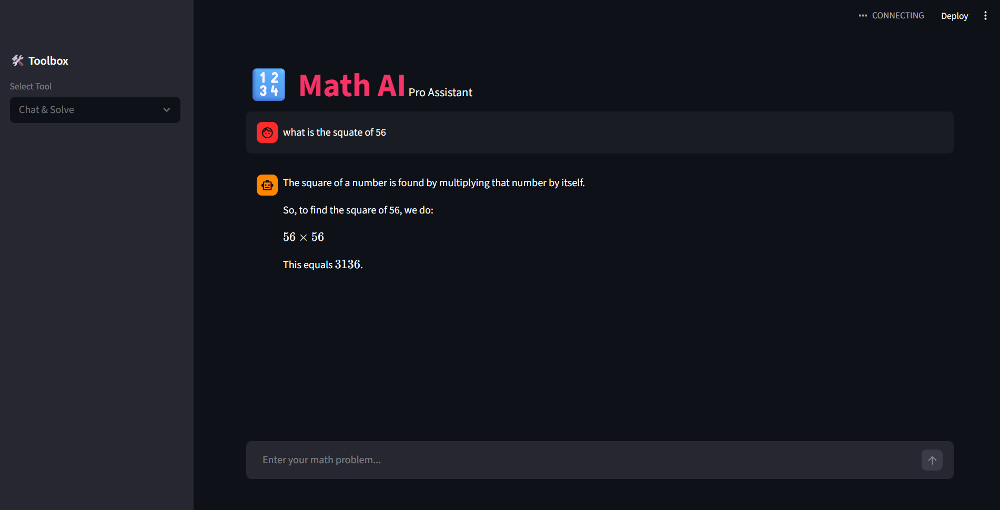
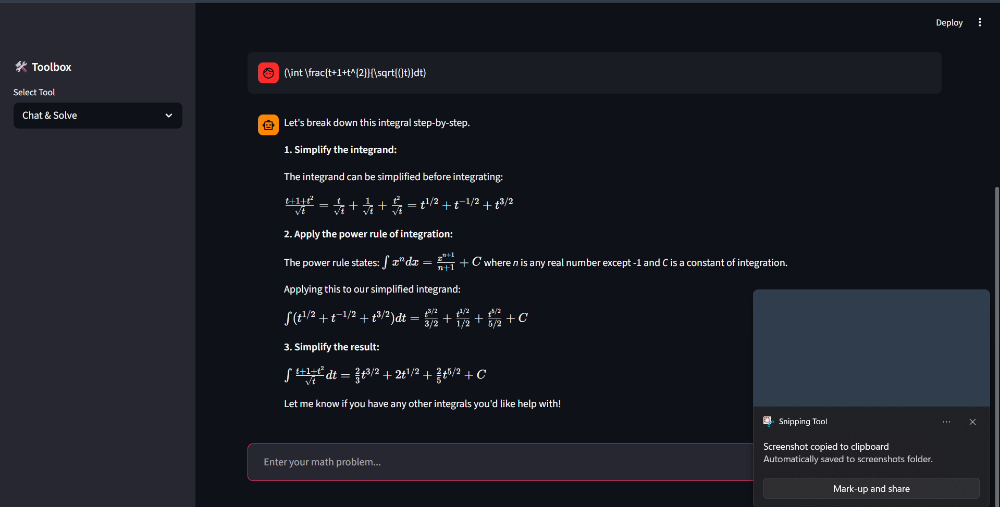

# 🔢 Math AI Pro Assistant

A professional-grade mathematical solver and tutor web application. This project uses local Large Language Models (LLMs) to provide step-by-step math solutions and real-time function graphing.

## 🚀 Features
- **Conversational AI Tutor:** Powered by **Gemma 2:2b** via Ollama for natural, step-by-step explanations.
- **Dynamic Function Grapher:** Visualizes mathematical expressions using **Matplotlib** and **SymPy**.
- **LaTeX Rendering:** All mathematical formulas are rendered in high-quality textbook format ($x^2 + y^2 = r^2$).
- **Modern UI:** A sleek, custom **Dark Mode** interface built with Streamlit.

## 🛠️ Tech Stack
- **Frontend:** Streamlit
- **AI Framework:** LangChain & Ollama
- **Math Engine:** SymPy & NumPy
- **Visualization:** Matplotlib

## ⚙️ Setup & Installation

1. **Clone the repository:**
   ```bash
   git clone [https://github.com/ShubhamN-31/Math-AI-App.git](https://github.com/ShubhamN-31/Math-AI-App.git)
   cd Math-AI-App
## 📸 Preview

### AI Chat Interface



